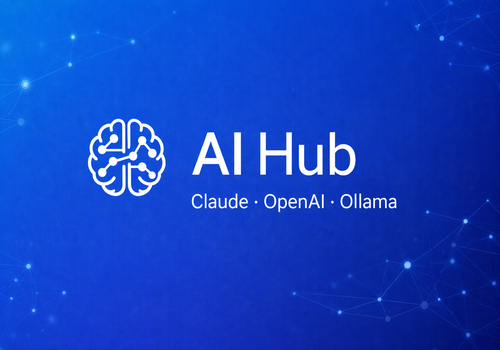

<p align="center">
  
</p>

<h1 align="center">AI Hub for Homey</h1>

<p align="center">
  Use Claude, OpenAI, and Ollama AI directly in your Homey Flows.<br/>
  Ask questions, control smart home devices with natural language, and analyze images.
</p>

<p align="center">
  <a href="https://homey.app/a/com.michel.ai-hub/">Homey App Store</a> &middot;
  <a href="https://github.com/michelhelsdingen/homey-ai-hub/issues">Report Bug</a> &middot;
  <a href="https://github.com/michelhelsdingen/homey-ai-hub/issues">Request Feature</a>
</p>

---

## Features

- **Ask AI anything** — Use Claude, OpenAI, or Ollama from any Homey Flow
- **Smart home control** — "Turn off the living room lights" — the AI decides whether to answer or control your devices
- **Image analysis** — Analyze security camera snapshots, delivery photos, or any image with vision-capable models
- **Provider fallback** — If your primary provider fails, automatically try the next one
- **Conversation memory** — Multi-turn conversations that remember context across Flows
- **Custom models** — Choose a specific provider and model per Flow card, or let the default handle it
- **Webhook API** — Trigger AI from external services (Home Assistant, Node-RED, n8n, etc.)
- **Ollama support** — Run AI locally on your own hardware, fully private

## Requirements

- **Homey Pro** (2023 or newer) with firmware **13.0.0** or higher
- At least one AI provider:
  - [Claude](https://console.anthropic.com/) API key
  - [OpenAI](https://platform.openai.com/) API key
  - [Ollama](https://ollama.com/) running on your local network

## Installation

Install from the [Homey App Store](https://homey.app/a/com.michel.ai-hub/).

After installing:

1. Open the AI Hub app settings in the Homey app
2. Enter your API key(s) for the provider(s) you want to use
3. For Ollama: enter the host URL (e.g. `http://192.168.1.100:11434`)
4. Use the **Test** button to verify your connection
5. Start using the Flow cards!

## Flow Cards

### Actions

| Card | Description |
|------|-------------|
| **Ask or command AI** | Send a prompt using your default provider. AI answers or controls devices automatically. |
| **Ask or command AI (custom)** | Same, but pick a specific provider and model. |
| **Analyze image with AI** | Send an image (e.g. camera snapshot) for analysis. |
| **Analyze image with AI (custom)** | Image analysis with a specific provider and model. |
| **Clear conversation** | Reset a conversation's memory by ID. |

### Triggers

| Card | Description |
|------|-------------|
| **AI has responded** | Fires when AI returns a response. Tokens: response, provider, model, original prompt. |
| **AI webhook received** | Fires when an external service sends a webhook to the app. |

## Webhook API

Send a POST request to trigger AI from external services:

```
POST http://<homey-ip>/api/app/com.michel.ai-hub/webhook
Content-Type: application/json

{
  "message": "Turn off all lights",
  "flag": "automation"
}
```

The webhook triggers the **AI webhook received** Flow card with the message and flag as tokens.

## Development

This is a Python-based Homey app using SDK 3.

```bash
# Install dependencies
npm install
npx homey app dependencies install

# Run locally
npx homey app run

# Run tests
python -m pytest tests/
```

## Contributing

Contributions are welcome! Please open an issue first to discuss what you'd like to change.

1. Fork the repository
2. Create your feature branch (`git checkout -b feature/amazing-feature`)
3. Commit your changes
4. Push to the branch
5. Open a Pull Request

## License

This project is licensed under the MIT License — see the [LICENSE](LICENSE) file for details.

## Author

**Michel Helsdingen**

- [Homey App Store](https://homey.app/a/com.michel.ai-hub/)
- [GitHub](https://github.com/michelhelsdingen)
